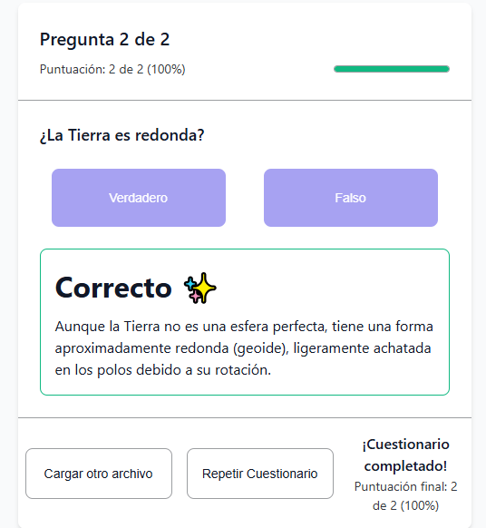

# Quizz App

## Descripción 📄

This project is useful to charge a json to do a practice true/false exam.

### Deploy 🔥
```
https://quizz-app-kvlo.onrender.com
```

<div style="display: flex; gap: 1rem;">
  
  
</div>

### Build with 🔨
* [Preact](https://preactjs.com/) - Library
* [Node.js](https://nodejs.org/es/) - Runtime
* [Javascript]() - Programming Language
* [Html](https://html.com/) - Markdown Language
* [CSS](https://www.w3.org/Style/CSS/Overview.en.html) -  Style Sheet Language

## Author 👑
Rafael Garcia Perez
[GitHub - Rafael3994](https://github.com/Rafael3994)
[Linkedin - Rafael3994](https://www.linkedin.com/in/rafael3994/)
